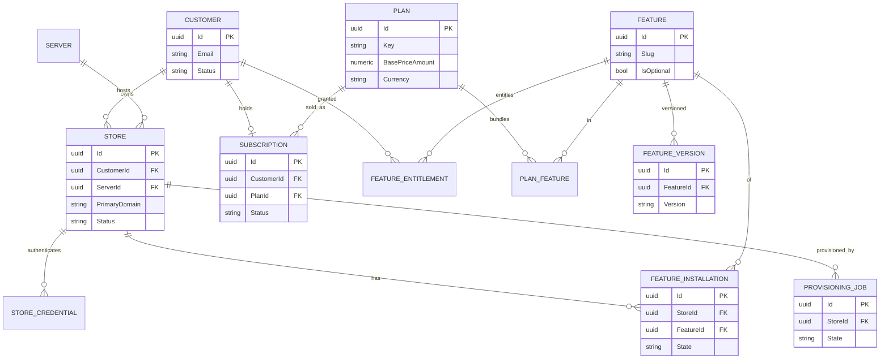
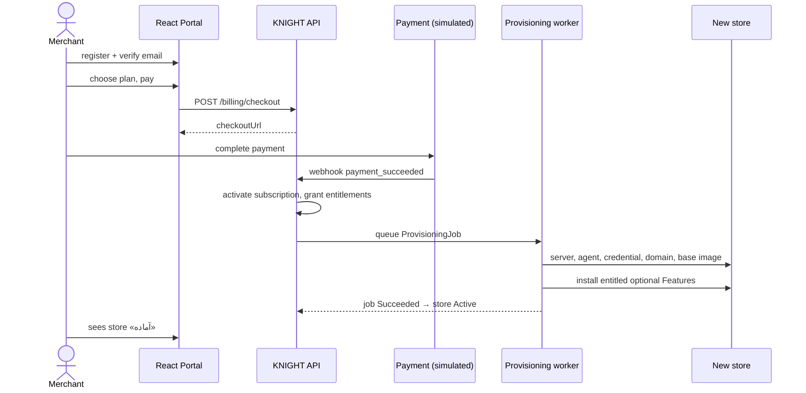
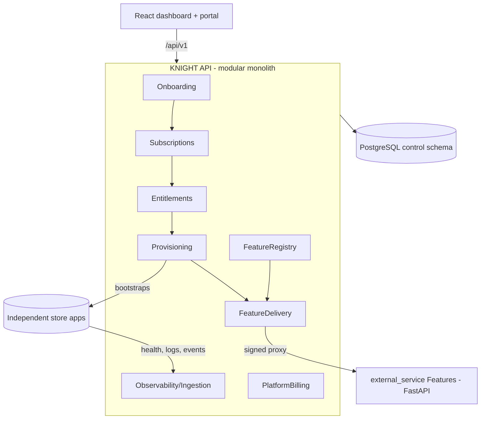

# KNIGHT — Diagrams (generated summary)

> Generated from the codebase. Mermaid renders on GitHub and most Markdown viewers.
> Simplified on purpose — the real schema has more columns; see
> `Knight.Infrastructure/ControlPlane/ControlPlaneDbContext.cs` for the full set.

## 1. ERD — the core control-plane entities

What to look at: a **Customer** owns **Stores** and holds a **Subscription** to a
**Plan**; the Plan bundles **Features**; each Feature has versioned packages that
get **installed** onto a Store; buying queues a **ProvisioningJob**.

## 2. Sequence — self-service happy path (register → running store)

What to look at: payment is what drives provisioning; no operator step in the
middle. The store's base Features come from its image; only optional Features are
delivered.

## 3. Component — the shape of the system

What to look at: one modular-monolith API in the middle; independent stores and
feature-services around it; a shared PostgreSQL for the control plane.

